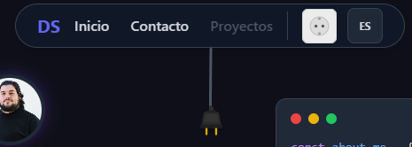
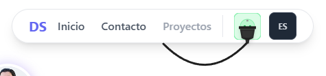
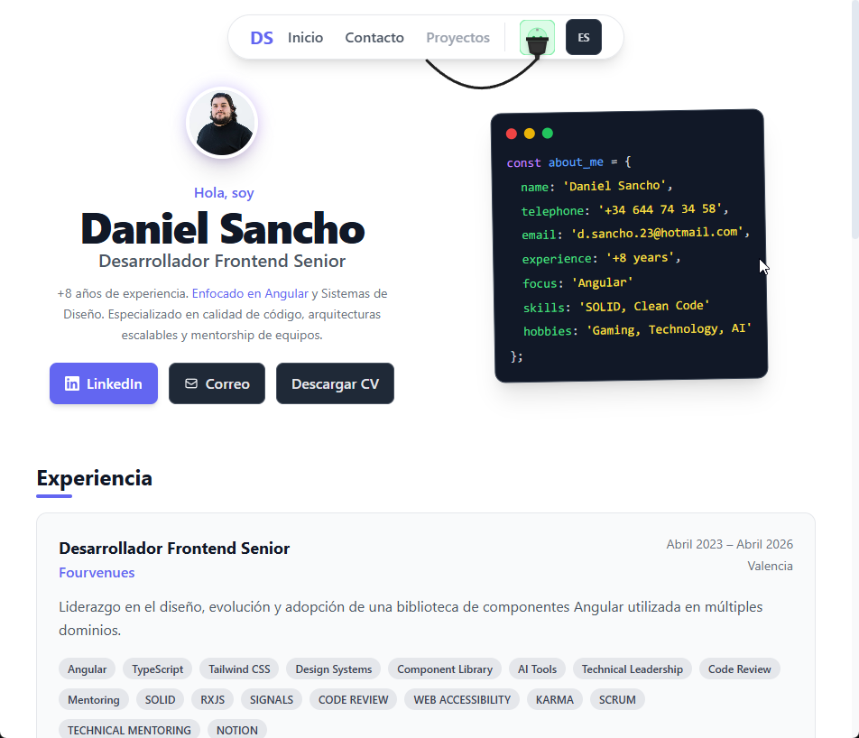
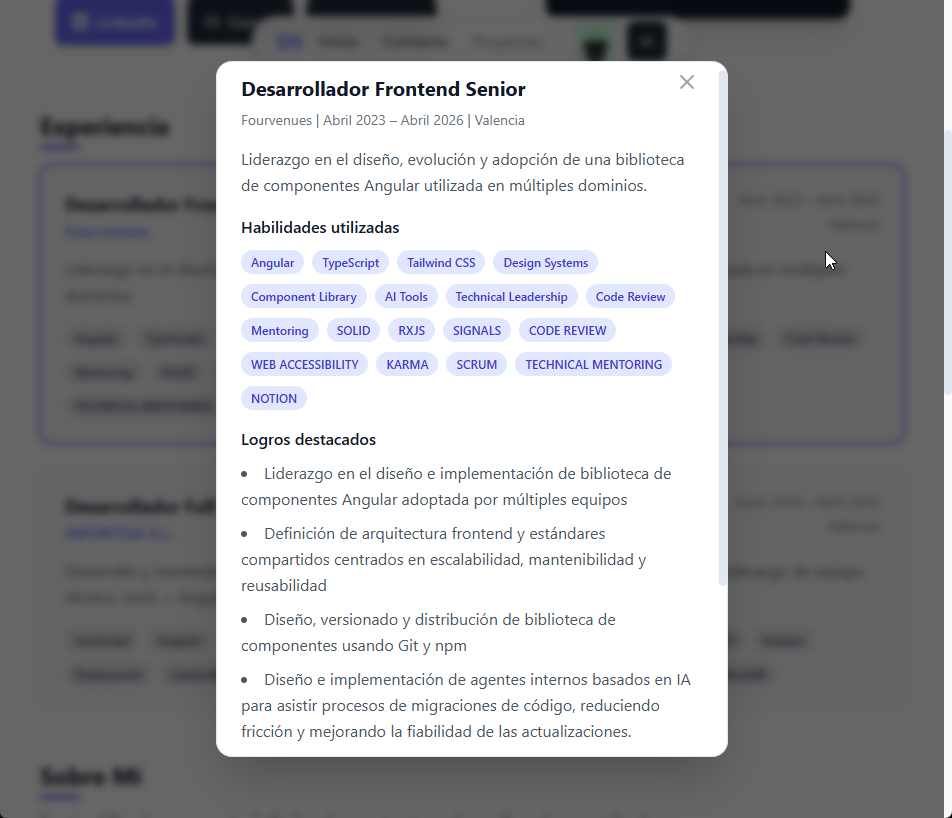
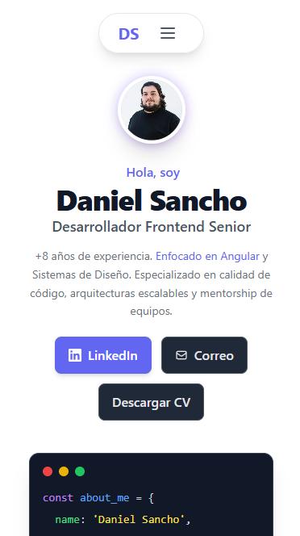

# Daniel Sancho - CV Portfolio

Welcome to my interactive CV portfolio repository! This project serves not only as my digital resume but also as a demonstration of my front-end development skills, particularly in Angular, UI/UX design, and software testing. <a href="https://dani-sancho.github.io">Link to project</a>

## 📸 Project Overview

Here are some screenshots of the application:

### Light Mode & Dark Mode with Interactive Theme Toggle

### Responsive Design & Information Architecture

## 🧪 Testing & Code Quality

I believe that robust testing is a cornerstone of professional software development. In this project, I have implemented a comprehensive testing strategy to ensure reliability and maintainability.

### End-to-End (E2E) Testing with Playwright
The application uses [Playwright](https://playwright.dev/) for end-to-end testing, simulating real user interactions across different browsers (Chromium, Firefox, WebKit).
- Playwright is fully configured as seen in `playwright.config.ts`.
- Run tests using `npx playwright test`.
- A fully parallelized testing environment ensures quick feedback loops.

### Component & Unit Testing
Unit tests are configured using [Karma](https://karma-runner.github.io/), Angular's default test runner, providing robust testing capabilities. Angular's testing utilities are used to verify that individual components render and behave as expected in isolation.
- You can find `.spec.ts` files alongside each component (e.g., `footer.component.spec.ts`).
- Run tests using `npm run test` or `ng test`.

## 🛠️ Tech Stack & Architecture
- **Framework:** Angular 
- **Language:** TypeScript
- **Styling:** SCSS, custom design system, focus on accessibility and responsiveness.
- **Testing:** Playwright (E2E), Karma (Unit/Component)
- **Deployment:** GitHub Pages

Thank you for visiting my repository! If you have any questions or want to get in touch, feel free to reach out via LinkedIn or Email as linked in the portfolio.
